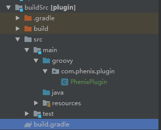
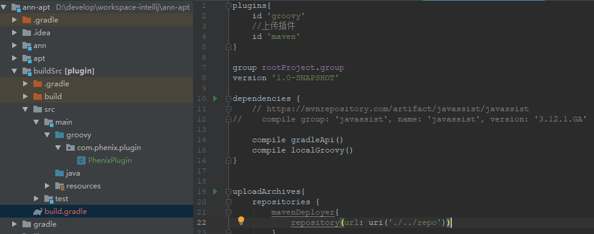
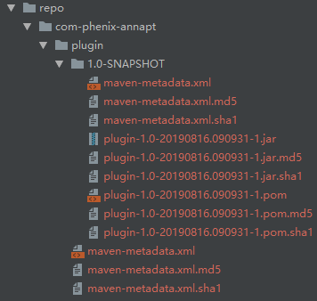

# D-Annoation

AOP {APT,AspectJ,Javassist}

环境：idea + java + gradle

[项目地址D-Annoation](https://github.com/zhouphenix/D-Annoation)https://github.com/zhouphenix/D-Annoation

[TOC]

## 一、实践篇
###1.   APT(AnnotationProcessor) 注解代码生成

build.gradle中添加依赖（依赖module或jar）：
```groovy
    implementation project(':ann')
    annotationProcessor project(':apt')
```

使用方式：


```java
@InstanceAnns({
        @InstanceAnn,
        @InstanceAnn("java.lang.Object"),
        @InstanceAnn({"java.lang.Object", "java.lang.String"})
})
public class TestAnn {}

```

其中InstanceAnn value值： 表示构造方法参数类型

使用 `TestAnn testAnn = InstanceFactory.create(TestAnn.class, "123");`

生成代码
```java

/**
 * @ 实例化工厂 此类由apt自动生成
 */
public final class InstanceFactory {
  /**
   * @此方法由apt自动生成
   */
  public static <T> T create(final Class<T> mClass) throws IllegalAccessException,
      InstantiationException, NoSuchMethodException, InvocationTargetException {
     switch (mClass.getName())  {
      case "com.phenix.test.TestAnn": 
        return  (T)new TestAnn();
      default: return mClass.getConstructor().newInstance();
    }
  }

  /**
   * @此方法由apt自动生成
   */
  public static <T> T create(final Class<T> mClass, Object p0, String p1) throws
      IllegalAccessException, InstantiationException, NoSuchMethodException,
      InvocationTargetException {
     switch (mClass.getName())  {
      case "com.phenix.test.SubTestAnn": 
        return  (T)new SubTestAnn(p0,p1);
      case "com.phenix.test.Main": 
        return  (T)new Main(p0,p1);
      case "com.phenix.test.TestAnn": 
        return  (T)new TestAnn(p0,p1);
      default: return mClass.getConstructor(java.lang.Object.class,java.lang.String.class).newInstance(p0,p1);
    }
  }

  /**
   * @此方法由apt自动生成
   */
  public static <T> T create(final Class<T> mClass, Object p0) throws IllegalAccessException,
      InstantiationException, NoSuchMethodException, InvocationTargetException {
     switch (mClass.getName())  {
      case "com.phenix.test.SubTestAnn": 
        return  (T)new SubTestAnn(p0);
      case "com.phenix.test.TestAnn": 
        return  (T)new TestAnn(p0);
      default: return mClass.getConstructor(java.lang.Object.class).newInstance(p0);
    }
  }

  /**
   * @此方法由apt自动生成
   */
  public static <T> T create(final Class<T> mClass, String p0) throws IllegalAccessException,
      InstantiationException, NoSuchMethodException, InvocationTargetException {
     switch (mClass.getName())  {
      case "com.phenix.test.Main": 
        return  (T)new Main(p0);
      default: return mClass.getConstructor(java.lang.String.class).newInstance(p0);
    }
  }
}
```
【注意】
* 1.注解可继承，但子类InstanceAnns需要比父类范围大，否则不会区别差异，除非重新注解
* 2.泛型 明显不适合改注解，除非添加所有支持的构造类型


#### 2.[AspectJ——简介以及在IntelliJ IDEA下的配置](AspectJ——简介以及在IntelliJ IDEA下的配置)
【注意】：AspectJ 需要放在主module下

【注意】：AspectJ 需要放在主module下

【注意】：AspectJ 需要放在主module下

重要的事说三遍...


#### 3.[自定义Gradle-Plugin 插件详解-Javassist](https://www.jianshu.com/p/f1bd232e7a62)

Gradle自定义插件三种方式：

1. build.gradle脚本中直接使用。这种方式就是直接在Android Studio app moudle的build.gradle 中进行插件的编写，优点就是不用再上传插件到maven或者其它地方，项目就可以直接使用；缺点也是很明显，就是只能在自己的项目中使用，不能复用，这个不是我们今天要说的。

2. buildSrc中使用。这种方式需要在项目中新建一个moudle命名为buildSrc，这个目录就用来存放自定义插件。然后在src/main中建立两个目录，一个就是存放代码的groovy目录，一个是存放自定义插件名称的resources目录。这种定义方式也是只能在我们项目中进行使用，不好复用。 

3. 独立Module中使用。这种方式就是完全独立开发一个Module，可以随便用。 

   

##### 3.1 build.gradle脚本中直接使用

把插件写在build.gradle 文件中，一般用于简单的逻辑，只在改build.gradle 文件中可见，这里直接贴出Demo代码： 

```groovy
/**
 * 插件入口类
 */
class TestPlugin implements Plugin<Project> {
    @Override
    void apply(Project project) {
        //do something
    }
}

apply plugin: TestPlugin
```


##### 3.2 buildSrc中使用

######  3.2.1新建一个 module，选择 library module，module 名字必须为 buildSrc

###### 3.2.2删除 module 下所有文件，build.gradle 配置替换如下：

```
plugins{
    id 'groovy'
}

group rootProject.group
version '1.0-SNAPSHOT'

dependencies {
    compile gradleApi()
    compile localGroovy()
}

```

######  3.2.3新建 groovy 目录 

 

######  3.2.4新建 Plugin 类 

需要注意： groovy 目录下新建类，需要选择 file且以`.groovy`作为文件格式。 

```groovy
package com.phenix.plugin

import org.gradle.api.Plugin
import org.gradle.api.Project

class PhenixPlugin implements Plugin<Project>{
    @Override
    void apply(Project project) {

        println "=========================="
        println "Javassist开始修改class"
        println "=========================="

        project.logger.debug("===============PhenixPlugin================")
    }
}
```

主module中引用 `apply plugin: PhenixPlugin`  gradle build

```
> Task :buildSrc:compileJava NO-SOURCE
> Task :buildSrc:compileGroovy UP-TO-DATE
> Task :buildSrc:processResources UP-TO-DATE
> Task :buildSrc:classes UP-TO-DATE
> Task :buildSrc:jar UP-TO-DATE
> Task :buildSrc:assemble UP-TO-DATE
> Task :buildSrc:compileTestJava NO-SOURCE
> Task :buildSrc:compileTestGroovy NO-SOURCE
> Task :buildSrc:processTestResources NO-SOURCE
> Task :buildSrc:testClasses UP-TO-DATE
> Task :buildSrc:test NO-SOURCE
> Task :buildSrc:check UP-TO-DATE
> Task :buildSrc:build UP-TO-DATE

> Configure project :
==========================
Javassist开始修改class
==========================
```

##### 3.3独立Module中使用

直接在buildSrc module中修改



配置repository，供其他project引用

build.gradle中

```groovy
plugins{
    id 'groovy'
    //上传插件
    id 'maven'
}

group rootProject.group
version '1.0-SNAPSHOT'

dependencies {
    // https://mvnrepository.com/artifact/javassist/javassist
//    compile group: 'javassist', name: 'javassist', version: '3.12.1.GA'

    compile gradleApi()
    compile localGroovy()
}

//上传task
uploadArchives{
    repositories {
        mavenDeployer{
            repository(url: uri('./../repo'))
        }
    }
}
```

resources文件夹下新建META-INF/gradle-plugins/phenix.properties，文件名称即为插件名称， 内容：

```
implementation-class=com.phenix.plugin.PhenixPlugin
```

执行task： uploadArchives



引用插件

```groovy
plugins {
    //...
    // 自定义插件
    id 'phenix'
   }
```


## 二、例子篇

此篇包括大部分常用的AnnotationProcessor + javapoet使用到的情况
通过@ExampleAnn 启用

生成代码：
```java

/**
 * @author     ：zhouphenix
 * @date       ：Created in 2019-8-12 9:23:38
 * @description：此方法由apt自动生成
 * @version    : V1.0
 */
public class ExampleAnn<V> {
  static {
    System.out.println("static 块");
  }

  private V mV;

  private List<V> mListV;

  /**
   * 添加 private int mField
   */
  private int mField = 2;

  /**
   * 添加数组类型 private int[] mArr
   */
  private int[] mArr;

  /**
   * 添加对象类型 private File mRef
   */
  private File mRef = new File("D:\\123.png");

  {
    System.out.println("普通{} 块");
  }

  /**
   * 构造方法
   */
  public ExampleAnn() {
    System.out.println("构造构造");
  }

  /**
   * static + void + (String) method 
   */
  public static void method(final String s, final String... ss) {
    System.out.println(s + Arrays.toString(ss));
  }

  /**
   * override toString()
   */
  @Override
  public String toString() {
    return super.toString();
  }

  /**
   * 泛型参数排序方法
   */
  public static <T extends Comparable<? super T>> void sort(List<T> list) throws Exception {
  }

  /**
   * 泛型参数排序方法
   */
  public static <T extends Comparable<? super T>> void sort(List<T> list, Comparator<? super T> c) {
    System.out.println("sort(List<T> list, Comparator<? super T> c)");
    Collections.sort(list,c);
  }

  /**
   * main()
   */
  public static void main(String[] args) {
    // Hello, JavaPoet!
    System.out.println("Hello, JavaPoet!");
    File f = new File("D:\\123.png");
    System.out.println("Does f exist?" + f.exists());
    // for循环
    int total = 0;
    for (int i = 0; i < 10; i++) {
      total += i;
    }
    // 调用method(s)
    method("Hello ExampleAnn!");
    // if-else if-else语法
    long now = System.currentTimeMillis();
    if (System.currentTimeMillis() < now) {
      System.out.println("Time travelling, woo hoo!");
    } else if (System.currentTimeMillis() == now) {
      System.out.println("Time stood still!");
    } else {
      System.out.println("Ok, time still moving forward");
    }
    // try... catch... finally语法
    try {
      throw new Exception("Failed");
    } catch (Exception e) {
      e.printStackTrace();
    } finally {
    }
    // while语法
    total = 0;
    while (total < 10) {
      total ++;
      System.out.println(total);
    }
    // do... while语法
    System.out.println("+++++++分割线+++++++");
    do {
      total ++;
      System.out.println(total);
    } while (total < 12);
    // 调用sort(List<T> list, Comparator<? super T> c)
    int[] arr = new int[]{3,1,0,1,2,3,4,5};
    List<String> list = new ArrayList();
    // for...each 循环
    for(int i : arr){
    list.add(i+"");
    }
    System.out.println("排序前：" + list);
    sort(list, new Comparator<String>() {
      @Override
      public int compare(String o1, String o2) {
        return o1.compareTo(o2);
      }
    });
    System.out.println("排序后：" + list);
  }

  /**
   * 内部类
   */
  class InnerClass {
  }
}

```
运行Gradle栏命令 `ann-apt [run]`

```
> Task :run
Hello world!
com.phenix.test.TestAnn@15db9742,123
Hello phenix
class java.lang.Object
class java.lang.String
class java.lang.Integer
 ==== [class java.lang.Object, class java.lang.String, class java.lang.Integer]
static 块
普通{} 块
构造构造
com.phenix.ExampleAnn@6d06d69c
Hello, JavaPoet!
Does f exist?true
Hello ExampleAnn![]
Time stood still!
java.lang.Exception: Failed
	at com.phenix.ExampleAnn.main(ExampleAnn.java:111)
	at com.phenix.test.Main.main(Main.java:36)
1
2
3
4
5
6
7
8
9
10
+++++++分割线+++++++
11
12
排序前：[3, 1, 0, 1, 2, 3, 4, 5]
sort(List<T> list, Comparator<? super T> c)
排序后：[0, 1, 1, 2, 3, 3, 4, 5]
SM[X, 招军买马]
com.phenix.test.TestAnn@4e25154f,java.lang.Object@70dea4e
0,, [class java.lang.Object, class java.lang.String]
1,, [class java.lang.Object]
2,, []
com.phenix.test.SubTestAnn@5c647e05,enen

BUILD SUCCESSFUL in 889ms
8 actionable tasks: 2 executed, 6 up-to-date
9:34:36: Task execution finished 'run'.

```


### LICENSE
```
Copyright (c)2019-present zhouphenix

   Licensed under the Apache License, Version 2.0 (the "License");
   you may not use this file except in compliance with the License.
   You may obtain a copy of the License at

       http://www.apache.org/licenses/LICENSE-2.0

   Unless required by applicable law or agreed to in writing, software
   distributed under the License is distributed on an "AS IS" BASIS,
   WITHOUT WARRANTIES OR CONDITIONS OF ANY KIND, either express or implied.
   See the License for the specific language governing permissions and
   limitations under the License.
```