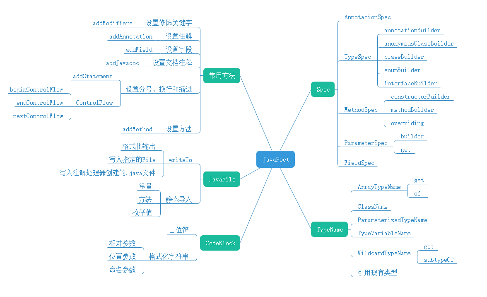

# JavaPoet使用详解

**参考文章地址： https://blog.csdn.net/IO_Field/article/details/89355941#ParameterSpec_796**

[TOC]

## 简介

JavaPoet定义了一系列类来尽可能优雅的描述java源文件的结构。观察JavaPoet的代码主要的类
可以分为以下几种：

`Spec`：用来描述Java中基本的元素，包括类型，注解，字段，方法和参数等。
`AnnotationSpec`：用于生成注解对象的类
`FieldSpec`：用于配置生成成员变量的类
`MethodSpec`：用于生成方法对象的类
`ParameterSpec`：用于生成参数对象的类
`TypeSpec`：用于生成类、接口、枚举对象的类
`TypeName`：用来描述类型的引用，包括Void，原始类型（int，long等）和Java类等。
`ArrayTypeName`：通过指定元素类型生成包含该元素的数组，或获取指定的mirror/type等效的数组类型
`ClassName`：通过包名和类名生成的对象，在JavaPoet中相当于为其指定Class
`ParameterizedTypeName`：通过MainClass和IncludeClass生成包含泛型的Class
`TypeVariableName`：类型变量类型
`WildcardTypeName`：通配符类型
`CodeBlock`：用来描述代码块的内容，包括普通的赋值，if判断，循环判断等。
`JavaFile`：完整的Java文件，JavaPoet的主要的入口。
`CodeWriter`：读取JavaFile并转换成可阅读可编译的Java源文件。




## 常用方法

### 设置修饰关键字

```java
addModifiers(Modifier... modifiers) 
```

Modifier是一个枚举对象，枚举值为修饰关键字`public`、`protected`、`private`、`static`、`final`
等。

所有在JavaPoet创建的对象都必须设置修饰符(包括方法、类、接口、枚举、参数、变量)。

### 设置注解

```java
addAnnotation(AnnotationSpec annotationSpec)
addAnnotation(ClassName annotation)
addAnnotation(Class<?> annotation)
addAnnotations(java.lang.Iterable<AnnotationSpec> annotationSpecs)
```

该方法即为类或方法或参数设置注解，参数即可以是`AnnotationSpec`，也可以是`ClassName`，也可以直接传递Class对象，甚至可以是调用`addAnnotations`直接传递一个`AnnotationSpec`列表。一般情况下，包含复杂属性的注解一般用`AnnotationSpec`，如果单纯添加基本注解，无其他附加属性可以直接使用ClassName或者Class即可。

### 设置字段

```java
addField(FieldSpec fieldSpec) 
addField(TypeName type, java.lang.String name, javax.lang.model.element.Modifier... modifiers) 
addField(java.lang.reflect.Type type, java.lang.String name, javax.lang.model.element.Modifier... modifiers) 
addFields(java.lang.Iterable<FieldSpec> fieldSpecs)
```

该方法为类或接口设置字段,参数可以是FieldSpec,也可以通过指定字段的类型、修饰符及名称,或者通过调用`addFields`传递多个参数。 


### 设置文档注释

```java
addJavadoc(CodeBlock block) 
addJavadoc(java.lang.String format, java.lang.Object... args)
```

在编写类、方法、成员变量时，可以通过addJavadoc来设置注释，可以直接传入String对象，或者传入`CodeBlock`(代码块)。 

### 设置分号、换行和缩进

JavaPoet的大多数API都使用普通的旧的不可变Java对象。还有构建器，方法链和varargs来使AP
I友好。 JavaPoet为类和接口(TypeSpec)，字段(FieldSpec)，方法和构造函数(MethodSpe c)，参数(ParameterSpec)和注解(AnnotationSpec)提供模型。但是方法和构造函数的主体并未建模。 没有表达式类，没有语句类或语法树节点。为了简化繁琐的手动分号，换行和缩进，JavaPoet提供简便的了API：

`addStatement`:用于处理分号和换行符

```
addStatement(CodeBlock codeBlock)
addStatement(java.lang.String format, java.lang.Object… args)
```


`ControlFlow`: 用于括号，换行符和缩进

```
beginControlFlow(java.lang.String controlFlow, java.lang.Object… args):
endControlFlow
endControlFlow()
endControlFlow(java.lang.String controlFlow, java.lang.Object… args)
nextControlFlow()
```

### 设置方法

```
addMethod(MethodSpec methodSpec) 
addMethods(java.lang.Iterable<MethodSpec> methodSpecs)
```

在编写类/接口时，通过`addMethod()`或`addMethods()`添加方法。 

### TypeSpec

`TypeSpec`为生成的类，接口或枚举声明。

获取TypeSpec.Builder：

annotationBuilder：创建注解

```
annotationBuilder(ClassName className)
annotationBuilder(java.lang.String name)
```

anonymousClassBuilder：创建内部类

```
anonymousClassBuilder(CodeBlock typeArguments)
anonymousClassBuilder(java.lang.String typeArgumentsFormat, java.lang.Object… args)
```

classBuilder：创建类

```
classBuilder(ClassName className)
classBuilder(java.lang.String name)
```

enumBuilder：创建枚举类

```
enumBuilder(ClassName className)
enumBuilder(java.lang.String name)
```

interfaceBuilder：创建接口

```
interfaceBuilder(ClassName className)
interfaceBuilder(java.lang.String name)
```

TypeSpec.Builder的API 

`addAnnotation`：设置注解
`addEnumConstant`：设置枚举值(仅用于枚举类)
`addField`：设置字段
`addInitializerBlock`：设置初始化代码块
`addJavadoc`：设置注释
`addOriginatingElement`：设置注解处理器的源元素
`addStaticBlock`：设置静态代码块
`addSuperinterface`：设置实现的接口

```
addSuperinterface(java.lang.reflect.Type superinterface)
addSuperinterface(TypeName superinterface)
```

`addType`：添加内部类

```
addType(TypeSpec typeSpec)
addTypes(java.lang.Iterable typeSpecs)
```

`addTypeVariable`：设置类型变量

```
addTypeVariable(TypeVariableName typeVariable)
addTypeVariables(java.lang.Iterable typeVariables)
```

`superclass`：设置父类

```
superclass(java.lang.reflect.Type superclass)
superclass(TypeName superclass)
```

### 创建类

使用`classBuilder`创建类。例如： 

```
// 字段：id
FieldSpec id = FieldSpec.builder(int.class, "id", Modifier.PUBLIC).build();

// 初始化代码块
CodeBlock initBlock = CodeBlock.builder()
	.add("$N = $L", id, 10)
	.build();
// 注释块
CodeBlock docBlock = CodeBlock.builder()
	.add("This is the example for generating class")
	.build();
// 方法
MethodSpec getIdMeth = MethodSpec.methodBuilder("getId")
	.returns(int.class)
	.addStatement("return this.$N", id)
	.build();
// 静态代码块
CodeBlock staticBlock = CodeBlock.builder()
	.add("$T EKY = $S", String.class, "key_tea")
	.build();

// 接口
ClassName swimInterface = ClassName.get("com.teaphy.poet.interfaces", "ISwim");
// 超类
ClassName supperClass = ClassName.get("com.teaphy.poet.module", "Student");

// 类型变量
TypeVariableName tTypeVariable = TypeVariableName.get("T");
TypeVariableName vTypeVariable = TypeVariableName.get("V", Number.class);

TypeSpec inner = TypeSpec.classBuilder("Inner").build();

// 使用classBuilder创建类
TypeSpec tea = TypeSpec.classBuilder("Tea")
	.addModifiers(Modifier.PUBLIC) // 设置修饰符
	.addAnnotation(Author.class) // 设置注解
	.addField(id) // 设置字段
	.addInitializerBlock(initBlock) // 设置初始化代码块
	.addJavadoc(docBlock) // 设置注释
	.addMethod(getIdMeth) // 设置方法
	.addStaticBlock(staticBlock) // 设置静态代码块
	.addSuperinterface(swimInterface) // 设置实现的接口
	.superclass(supperClass) // 设置父类
	.addTypeVariable(tTypeVariable) // 设置类型变量
	.addTypeVariable(vTypeVariable) // 设置类型变量
	.addType(inner) // 设置内部类
	.build();
```

生成的类： 

```
package com.teaphy.poet.generated;

import com.teaphy.poet.annotations.Author;
import com.teaphy.poet.interfaces.ISwim;
import com.teaphy.poet.module.Student;
import java.lang.Number;
import java.lang.String;

/**
 * This is the example for generating class 
 * */
@Author
public class Tea<T, V extends Number> extends Student implements ISwim {
  static {
    String EKY = "key_tea"
  }

  public int id;

  {
    id = 10}

  int getId() {
    return this.id;
  }

  class Inner {
  }
}
```

### 创建枚举类

使用`enumBuilder`创建枚举类，并调用`addEnumConstant`添加值。例如： 

```
TypeSpec enumBuilder = TypeSpec.enumBuilder("SexKind")
			.addEnumConstant("MAN")
			.addEnumConstant("WOMAN")
			.build();
JavaFile javaFile = JavaFile.builder("com.teaphy.poet.generated", enumBuilder)
	.build();
javaFile.writeTo(System.out);
```

生成的枚举类：

```
enum SexKind {
  MAN,

  WOMAN
}
```

### 创建接口

使用`interfaceBuilder`创建接口。

例如：

```
// 接口中声明的属性必须为被`public static final`
FieldSpec versionField = FieldSpec.builder(int.class, "Version")
	.addModifiers(Modifier.PUBLIC, Modifier.STATIC, Modifier.FINAL)// 属性默认为Public Static Final.
	.initializer("$L", 1)
	.build();

// 接口中声明的方法必须被[abstract, static, default]的其中之一修饰
MethodSpec abstractMeth = MethodSpec.methodBuilder("swim")
	.addModifiers(Modifier.ABSTRACT, Modifier.PUBLIC) // abstract方法必须被[public, private]其中之一修饰
	.build();
MethodSpec defaultMeth = MethodSpec.methodBuilder("tintDefault")
	.addModifiers(Modifier.DEFAULT, Modifier.PRIVATE)// default方法必须被[public, private]其中之一修饰
	.addStatement("$T.out.println($S);", System.class, "This is the example of the default method in the interface")
	.build();
MethodSpec staticMeth = MethodSpec.methodBuilder("tintStatic")
	.addModifiers(Modifier.STATIC, Modifier.PUBLIC)// static方法必须被[public, private]其中之一修饰
	.addStatement("$T.out.println($S);", System.class, "This is the example of the static method in the interface")
	.build();

TypeSpec faceBuilder = TypeSpec.interfaceBuilder("ISwim")
	.addModifiers(Modifier.PUBLIC) // 必须设置修饰符，public/private,否则报错`java.lang.IllegalArgumentException: modifiers [] must contain one of [public, private]`
	.addField(versionField)
	.addMethod(abstractMeth)
	.addMethod(defaultMeth)
	.addMethod(staticMeth)
	.build();
```

生成的接口：

```
package com.teaphy.poet.generated;

import java.lang.System;

public interface ISwim {
  int Version = 1;

  void swim();

  private default void tintDefault() {
    System.out.println("This is the example of the default method in the interface");;
  }

  static void tintStatic() {
    System.out.println("This is the example of the static method in the interface");;
  }
}
```

需要注意的是：

- 接口中声明的属性必须为`public static final`
- 接口中声明的方法必须被[`abstract`, `static`, `default`]的其中之一修饰,分别表示抽象方法、静态方法、默认方法
- 在JavaPoet中，`abstract`(或`static`，或`default`)方法必须被[`public`,`private`]其中之一修饰否则报错*java.lang.IllegalArgumentException: modifiers [] must contain one of [public, private]*

### 创建注解

使用`annotationBuilder`创建注解。

例如：

```
AnnotationSpec annoDoc = AnnotationSpec.builder(Documented.class).build();
AnnotationSpec annoRet = AnnotationSpec.builder(Retention.class)
	.addMember("value", "$T.$L", RetentionPolicy.class, RetentionPolicy.RUNTIME)
	.build();
AnnotationSpec annoTarget = AnnotationSpec.builder(Target.class)
	// $T 标识枚举类， $L 标识 枚举值
	.addMember("value", "$T.$L", ElementType.class, ElementType.TYPE)
	.addMember("value", "$T.$L", ElementType.class, ElementType.METHOD)
	.addMember("value", "$T.$L", ElementType.class, ElementType.FIELD)
	.build();

MethodSpec nameMeth = MethodSpec.methodBuilder("name")
	.addModifiers(Modifier.PUBLIC, Modifier.ABSTRACT)
	.returns(String.class)
	.defaultValue("$S", "tea") // 设置默认值
	.build();


TypeSpec authorBuilder = TypeSpec.annotationBuilder("Author")
	.addModifiers(Modifier.PUBLIC)
	.addAnnotation(annoDoc)
	.addAnnotation(annoRet)
	.addAnnotation(annoTarget)
	.addMethod(nameMeth)
	.build();
```

生成的注解： 

```
import java.lang.annotation.Target;

@Documented
@Retention(RetentionPolicy.RUNTIME)
@Target({
    ElementType.TYPE,
    ElementType.METHOD,
    ElementType.FIELD
})
public @interface Author {
  String name() default "tea";
}
```

### 创建匿名内部类

使用`anonymousClassBuilder`创建匿名内部类。 

```
// 匿名内部类实现的接口
ClassName swimInterface = ClassName.get("com.teaphy.poet.interfaces", "ISwim");

// 重写的方法
MethodSpec swimMeth = MethodSpec.methodBuilder("swim")
	.addModifiers(Modifier.PUBLIC)
	.addAnnotation(Override.class)
	.build();
// 创建匿名内部类
TypeSpec swimBuilder = TypeSpec.anonymousClassBuilder("")
	.addSuperinterface(swimInterface)
	.addMethod(swimMeth)
	.build();

FieldSpec fieldSwim = FieldSpec.builder(swimInterface, "swim")
	.initializer("$L", swimBuilder)
	.build();

// 匿名内部类的超类
ClassName frutesClass = ClassName.get("com.teaphy.poet.module", "Fruits");

String nameFru = "Apple";
float priceFru = 10.5f;
// 用于传递参数
CodeBlock pramBlock = CodeBlock.builder()
	.add("$S, $L", nameFru, priceFru)
	.build();

MethodSpec printDesc = MethodSpec.methodBuilder("printDesc")
	.addAnnotation(Override.class)
	.addStatement("$T.out.println($T.format(\"the price of the %s is %s\", $N, $N))", System.class,
		String.class,
		"name",
		"price")
	.build();

// 创建匿名内部类
TypeSpec fruitBuilder = TypeSpec.anonymousClassBuilder(pramBlock)
	.superclass(frutesClass)
	.addMethod(printDesc)
	.build();
FieldSpec fieldFru = FieldSpec.builder(frutesClass, "fruit")
	.initializer("$L", fruitBuilder)
	.build();

TypeSpec personBuilder = TypeSpec.classBuilder("Person")
	.addField(fieldSwim)
	.addField(fieldFru)
	.build();
```

生成的匿名内部类： 

```
package com.teaphy.poet.generated;

import com.teaphy.poet.interfaces.ISwim;
import com.teaphy.poet.module.Fruits;
import java.lang.Override;
import java.lang.String;
import java.lang.System;

class Person {
  ISwim swim = new ISwim() {
    @Override
    public void swim() {
    }
  };

  Fruits fruit = new Fruits("Apple", 10.5) {
    @Override
    void printDesc() {
      System.out.println(String.format("the price of the %s is %s", name, price));
    }
  };
}
```


注意：

- 生成的匿名内部类可以在代码块中用`$L`引用值
- 如果超类构造函数存在参数，要传递不同的参数，需使用JavaPoet的`CodeBlock`语法和逗号分隔参数

### AnnotationSpec

AnnotationSpec是声明上生成的注解，可以使用AnnotationSpec.builder()设置注解的属性
，也可以使用get方法依据指定的注解的设置属性。

```
get(java.lang.annotation.Annotation annotation)
get(java.lang.annotation.Annotation annotation, boolean includeDefaultValues)
get(javax.lang.model.element.AnnotationMirror annotation)
```

在AnnotationSpec.Builder中，通过调用addMember()方法给注解指定的属性设置值。

```
addMember(java.lang.String name, CodeBlock codeBlock) 
addMember(java.lang.String name, java.lang.String format, java.lang.Object... args)
```

例如： 

```
// 使用`get`方法依据指定的注解的设置属性。
Annotation annoDate = AnnotationSpec_Demo.class.getAnnotation(Date.class);
AnnotationSpec dateSpec = AnnotationSpec.get(annoDate);

// 使用`AnnotationSpec.builder()`设置注解的属性
ClassName annoAuthor = ClassName.get("com.teaphy.poet.annotations", "Author");
CodeBlock typeBlock = CodeBlock.builder()
	.add("$S", "B") // 这里不能调用addStatement,因为addStatement会添加分号，与语法不符
	.build();
AnnotationSpec authorSpec = AnnotationSpec.builder(annoAuthor)
	.addMember("name", "$S", "tea") // addMember设置注解属性
	.addMember("type", typeBlock)
	.build();
//
ClassName annoAuthors = ClassName.get("com.teaphy.poet.annotations", "Authors");
AnnotationSpec authorsSpec = AnnotationSpec.builder(annoAuthors)
	.addMember("value", "$L", authorSpec) // addMember设置注解属性
	.addMember("value", "$L", AnnotationSpec.builder(annoAuthor)
		.addMember("name", "$S", "teaA") // addMember设置注解属性
		.addMember("type", "$S", "C")
		.build())
	.build();

TypeSpec swimBuilder = TypeSpec.interfaceBuilder("ISwim")
	.addAnnotation(dateSpec)
	.addAnnotation(authorSpec)
	.addAnnotation(authorsSpec)
	.build();
```

生成的代码： 

```
package com.teaphy.poet.generated;

import com.teaphy.poet.annotations.Author;
import com.teaphy.poet.annotations.Authors;
import com.teaphy.poet.annotations.Date;

@Date(
    day = "11",
    month = "4",
    year = "2019"
)
@Author(
    name = "tea",
    type = "B"
)
@Authors({
    @Author(name = "tea", type = "B"),
    @Author(name = "teaA", type = "C")
})
interface ISwim {
}
```

需要注意的是：

- 当注解的属性值本身也是注解，可以使用$L进行设置嵌入式注解。
- 当使用相同的属性名称并多次调用addMember()时，以填充该属性的值列表。
- 在addMember()方法中，通过CodeBlock设置属性值时，只能调用其add()方法，而不能调用addStatement()方法，因为addStatement会添加分号，与语法不符。

### MethodSpec

`MethodSpec`是生成构造函数或方法的声明。JavaPoet生成方法分为两种，第一种是构造方法，另一种为常规方法(包括重写方法)。 

- 构造方法: MethodSpec.constructorBuilder()

- 常规方法: MethodSpec.methodBuilder(java.lang.String name)
- 重写方法: MethodSpec.overriding

```
overriding(javax.lang.model.element.ExecutableElement method)
overriding(javax.lang.model.element.ExecutableElement method, javax.lang.model.type.DeclaredType enclosing, javax.lang.model.util.Types types)
```

MethodSpec.Builder的API： 

`addAnnotation`：设置注解
`addCode`：设置方法体

```
addCode(CodeBlock codeBlock)
addCode(java.lang.String format, java.lang.Object… args)
```

`addComment`：设置单行注释

```
addComment(java.lang.String format, java.lang.Object… args)
```

`addJavadoc`：设置文档注释
`addModifiers`：设置修饰关键字
`addException`：设置异常

```
addException(java.lang.reflect.Type exception)
addException(TypeName exception)
addExceptions(java.lang.Iterable<? extends TypeName> exceptions)
```

`addNamedCode`：设置代码块，通过命名参数方式格式化字符串(详见CodeBock.格式化字符串)

```
addNamedCode(java.lang.String format, java.util.Map<java.lang.String,?> args)
```

`addParameter`：设置参数

```
addParameter(ParameterSpec parameterSpec)
addParameter(TypeName type, java.lang.String name, javax.lang.model.element.Modifier… modifiers)
addParameter(java.lang.reflect.Type type, java.lang.String name, javax.lang.model.element.Modifier… modifiers)
addParameters(java.lang.Iterable parameterSpecs)
```

`addStatement`：用于处理分号和换行符
`addTypeVariable`：设置类型变量

```
addTypeVariable(TypeVariableName typeVariable)
addTypeVariables(java.lang.Iterable typeVariables)
```


`ControlFlow`: 用于括号，换行符和缩进

```
beginControlFlow(java.lang.String controlFlow, java.lang.Object… args):
endControlFlow
endControlFlow()
endControlFlow(java.lang.String controlFlow, java.lang.Object… args)
nextControlFlow()
```

`defaultValue`：设置默认值

```
defaultValue(CodeBlock codeBlock)
defaultValue(java.lang.String format, java.lang.Object… args)
```

`returns`：设置返回值类型

```
returns(java.lang.reflect.Type returnType)
returns(TypeName returnType)
```

`varargs`：设置最后一个参数是否为可变参数

```
varargs()
varargs(boolean varargs)
```

例如： 

```
// 声明字段：id、name
FieldSpec idField = FieldSpec.builder(int.class, "id").build();
FieldSpec nameField = FieldSpec.builder(String.class, "name").build();

// 构造函数
MethodSpec constructor = MethodSpec.constructorBuilder()
	.addModifiers(Modifier.PUBLIC)
	.addParameter(ParameterSpec.builder(int.class, "id").build())
	.addParameter(ParameterSpec.builder(String.class, "name").build())
	.addStatement("this.$N=$N", idField, "id")
	.addStatement("this.$N=$N", nameField, "name")
	.build();

// 常规方法
Map<String, Object> map = new HashMap<>();
map.put("id", 1);
map.put("name", "tea");
TypeVariableName t = TypeVariableName.get("T");
TypeName subArray = ArrayTypeName.of(String.class);
MethodSpec doSwim = MethodSpec.methodBuilder("doSwim")
	.addModifiers(Modifier.PUBLIC) // 设置修饰关键字
	.addAnnotation(Author.class) // 设置注解
	.addParameter(ParameterSpec.builder(int.class, "id").build()) // 设置参数
	.addParameter(ParameterSpec.builder(String.class, "name").build())
	.addCode("$T a = $L", String.class, "A") // 设置方法体，此方法并不添加分号和换行。
	.addCode(";")
	.addCode("\n")
	.addComment("$L", "这是单行注释") // 设置单行注释
	.addException(IndexOutOfBoundsException.class) // 设置方法抛出的异常
	.addJavadoc("$L", "这里方法的文档注释") // 设置文档注释
	.addCode("$T desc = ", String.class)
	.addNamedCode("\"id: $id:L, name: $name:L\"", map) // 设置代码块，通过命名参数方式格式化字符串
	.addStatement("") // 设置分号/换行符
	.addTypeVariable(t) // 设置类型参数变量
	.addStatement("$T t", t) // 使用类型参数 声明局部变量
	.addStatement("long now = $T.currentTimeMillis()", System.class) // 设置分号、换行和缩进 -> start
	.beginControlFlow("if ($T.currentTimeMillis() < now)", System.class)
	.addStatement("$T.out.println($S)", System.class, "Time travelling, woo hoo!")
	.nextControlFlow("else if ($T.currentTimeMillis() == now)", System.class)
	.addStatement("$T.out.println($S)", System.class, "Time stood still!")
	.nextControlFlow("else")
	.addStatement("$T.out.println($S)", System.class, "Ok, time still moving forward")
	.addStatement("$T i = $L", int.class, 0)
	.beginControlFlow("do")
	.addStatement("i++")
	.endControlFlow("while(i < 5)") // 设置分号、换行和缩进 -> end
	.returns(t) // 设置返回值类型
	.addStatement("return t")
	.addParameter(subArray, "subjects")
	.varargs() // 设置最后一个参数为可变参数，注意，如果参数为可变参数，其数据类型必须为数组
	.build();

TypeSpec person = TypeSpec.classBuilder("Person") // 使用classBuilder创建类
	.addField(idField)
	.addField(nameField)
	.addMethod(constructor)
	.addMethod(doSwim)
	.build();
```

生成的方法： 

```
package com.teaphy.poet.generated;

import com.teaphy.poet.annotations.Author;
import java.lang.IndexOutOfBoundsException;
import java.lang.String;
import java.lang.System;

class Person {
  int id;

  String name;

  public Person(int id, String name) {
    this.id=id;
    this.name=name;
  }

  /**
   * 这里方法的文档注释 */
  @Author
  public <T> T doSwim(int id, String name, String... subjects) throws IndexOutOfBoundsException {
    String a = A;
    // 这是单行注释
    String desc = "id: 1, name: tea";
    T t;
    long now = System.currentTimeMillis();
    if (System.currentTimeMillis() < now) {
      System.out.println("Time travelling, woo hoo!");
    } else if (System.currentTimeMillis() == now) {
      System.out.println("Time stood still!");
    } else {
      System.out.println("Ok, time still moving forward");
      int i = 0;
      do {
        i++;
      } while(i < 5);
      return t;
    }
  }
}
```

### FieldSpec

FieldSpec是生成的字段的声明。

获取FieldSpec.Builder：

```
builder(TypeName type, java.lang.String name, javax.lang.model.element.Modifier… modifiers)
builder(java.lang.reflect.Type type, java.lang.String name, javax.lang.model.element.Modifier… modifiers)
```


FieldSpec.Builder的API:

`addAnnotation`：设置注解
`addJavadoc`：设置文档注释
`addModifiers`：设置修饰关键字
`initializer`: 成员变量的实例化

```
initializer(CodeBlock codeBlock)
initializer(java.lang.String format, java.lang.Object… args)
```

例如: 

```
// 创建一个 int 类型 的 成员变量 id,
FieldSpec idField = FieldSpec.builder(int.class, "age")
	.build();

// 创建一个成员变量并初始化 (name = "AAA")
FieldSpec nameField = FieldSpec.builder(String.class, "name")
	.addAnnotation(Author.class)
	.addModifiers(Modifier.PUBLIC) // 添加修饰符
	.initializer("$S", "AAA") // 成员变量实例化
	.build();
// 创建一个引用类型并初始化
FieldSpec stuField = FieldSpec.builder(Student.class, "student")
	.addModifiers(Modifier.PRIVATE)
	.initializer("new $T()", Student.class)
	.build();

TypeSpec person = TypeSpec.classBuilder("Person") // 使用classBuilder创建类
	.addField(idField)
	.addField(nameField)
	.addField(stuField)
	.build();

JavaFile javaFile = JavaFile.builder("com.teaphy.poet.generated", person)
	.build();
javaFile.writeTo(System.out);
```

生成的代码: 

```
package com.teaphy.poet.generated;

import com.teaphy.poet.annotations.Author;
import com.teaphy.poet.module.Student;
import java.lang.String;

class Person {
  int age;

  @Author
  public String name = "AAA";

  private Student student = new Student();
}
```

### ParameterSpec


在方法和构造函数上声明参数，使用ParameterSpec，或MethodSpec.addParameter()。对于ParameterSpec而言，可以使用ParameterSpec.builder()设置参数,也可以使用通过get方法依据指定参数元素设置参数。

```
builder(TypeName type, java.lang.String name, javax.lang.model.element.Modifier… modifiers)
builder(java.lang.reflect.Type type, java.lang.String name, javax.lang.model.element.Modifier… modifiers)
get(javax.lang.model.element.VariableElement element)
```


ParameterSpec.builder的API：

`addAnnotation`：设置注解
`addModifiers`：设置修饰类型

例如：

```
ParameterSpec namePram = ParameterSpec.builder(String.class, "name")
	.addAnnotation(Author.class)
	.build();

ParameterSpec sexPram = ParameterSpec.builder(int.class, "gender")
	.addModifiers(Modifier.FINAL)
	.build();

// 构造函数
MethodSpec constructor = MethodSpec.constructorBuilder()
	.addModifiers(Modifier.PUBLIC)
	.addParameter(int.class, "id")
	.addParameter(namePram)
	.addParameter(sexPram)
	.build();

TypeSpec person = TypeSpec.classBuilder("Person") // 使用classBuilder创建类
	.addMethod(constructor)
	.build();
```

生成的代码：

```
package com.teaphy.poet.generated;

import com.teaphy.poet.annotations.Author;
import java.lang.String;

class Person {
  public Person(int id, @Author String name, final int gender) {
  }
}
```

### CodeBlock

CodeBlock是生成代码块的声明。代码块是.java文件的一个片段，可能包含声明，语句和文档
,代码块不一定是格式良好的Java代码，也不是经过验证的。

代码块支持格式化占位符。其中String.format(java.lang.String，java.lang.Object ...)使用百分比％来引用目标值，而在CodeBlock中,使用美元符号$并具有自己的一组允
许的占位符：

- $L
- $N
- $S
- $T
- $$
- $W
- $Z
- $>
- $<
- $[
- $]

在JavaPoet中,CodeBlock是由静态方法join、of或者是CodeBlock.Builder的build()方法。

```
join(java.lang.Iterable codeBlocks, java.lang.String separator) -> CodeBlock
of(java.lang.String format, java.lang.Object… args) -> CodeBlock
```

### CodeBlock.Builder

获取CodeBlock.Builder可以通过CodeBlock的静态方法builder()或者toBuilder().

CodeBlock.Builder的API

`add(CodeBlock codeBlock) -> void`:添加一个代码块
`add(java.lang.String format, java.lang.Object… args)`:添加格式代码片段
`addNamed(java.lang.String format, java.util.Map<java.lang.String,?> arguments)`:使用命名参数添加代码。
`addStatement`:用于处理分号和换行符

```
addStatement(CodeBlock codeBlock)
addStatement(java.lang.String format, java.lang.Object… args)
```

ControlFlow: 用于括号，换行符和缩进

- beginControlFlow(java.lang.String controlFlow, java.lang.Object… args):

- endControlFlow

```
endControlFlow()
endControlFlow(java.lang.String controlFlow, java.lang.Object… args)
```

`indent()`:缩进
`nextControlFlow(java.lang.String controlFlow, java.lang.Object… args)`
`unindent()`:取消缩进
`isEmpty() -> boolean`:判断是否为空

例如： 

```
// 常规方法
Map<String, Object> map = new HashMap<>();
map.put("id", 1);
map.put("name", "tea");

CodeBlock codeBlock = CodeBlock.builder()
	
	.add("$T a = $L", String.class, "A") // 设置代码，此方法并不添加分号和换行。
	.add(";")
	.add("\n")
	
	.addNamed("\"id: $id:L, name: $name:L\"", map) // 设置代码块，通过命名参数方式格式化字符串，此方法并不添加分号和换行。
	.add("\n")
	
	.addStatement("int result = 1") // for
	.beginControlFlow("for (int i = 0; i < 10; i++)")
	.addStatement("result = result +  i")
	.endControlFlow()
	
	.addStatement("long now = $T.currentTimeMillis()",
		System.class) // if - else if - ... - else
	.beginControlFlow("if ($T.currentTimeMillis() < now)", System.class)
	.addStatement("$T.out.println($S)", System.class, "Time travelling, woo hoo!")
	.nextControlFlow("else if ($T.currentTimeMillis() == now)", System.class)
	.addStatement("$T.out.println($S)", System.class, "Time stood still!")
	.nextControlFlow("else")
	.addStatement("$T.out.println($S)", System.class, "Ok, time still moving forward")
	.endControlFlow()
	.addStatement("$T.out.println($S)", System.class, "Ok, time still moving forward")
	.addStatement("$T i = $L", int.class, 0)
	
	.addStatement("int id = 10") // while
	.beginControlFlow("while( id > 0)")
	.addStatement("$T.out.println(\"id: \" + $L)", System.class, "id")
	.addStatement("id--")
	.endControlFlow()
	
	.beginControlFlow("do") // do while
	.addStatement("i++")
	.endControlFlow("while(i < 5)")
	
	.beginControlFlow("try") // try - catch
	.addStatement("throw new Exception($S)", "Failed")
	.nextControlFlow("catch ($T e)", Exception.class)
	.addStatement("throw new $T(e)", RuntimeException.class)
	.endControlFlow()
	
	.build();
```

生成的代码 

```
String a = A;
"id: 1, name: tea"
int result = 1;
for (int i = 0; i < 10; i++) {
  result = result +  i;
}
long now = System.currentTimeMillis();
if (System.currentTimeMillis() < now) {
  System.out.println("Time travelling, woo hoo!");
} else if (System.currentTimeMillis() == now) {
  System.out.println("Time stood still!");
} else {
  System.out.println("Ok, time still moving forward");
}
System.out.println("Ok, time still moving forward");
int i = 0;
int id = 10;
while( id > 0) {
  System.out.println("id: " + id);
  id--;
}
do {
  i++;
} while(i < 5);
try {
  throw new Exception("Failed");
} catch (Exception e) {
  throw new RuntimeException(e);
}
```

注意：

- `add()`&`addNamed()`方法不添加分号和换行。若想分号或换行，需在字符串后缀添加`\n`或者调用`addStatement("id")`以添加分号或换行。


### 占位符

### $L

`$L`在JavaPoet中指的是没有转义的字面值,可以是字符串、基本数据类型、类型声明、注解甚至其他代码块。

例如：

```
FieldSpec priField = FieldSpec.builder(int.class, "pri")
		.initializer("$L", 1) // 字面值为基本数据类型
		.build();

FieldSpec strField = FieldSpec.builder(Class.class, "str")
	.initializer("str", "tea") // 字面值为String
	.build();

FieldSpec clzField = FieldSpec.builder(Class.class, "clz")
	.initializer("$L", Student.class) // 字面值为类型声明
	.build();

Annotation annoAuthor = Student.class.getAnnotation(Author.class);
FieldSpec annoField = FieldSpec.builder(Class.class, "anno")
	.initializer("$L", annoAuthor) // 字面值为注解
	.build();

CodeBlock codeBlock = CodeBlock.builder()
	.beginControlFlow("if (a > b)")
	.addStatement("return a")
	.nextControlFlow("else")
	.addStatement("return b")
	.endControlFlow()
	.build();
FieldSpec blockField = FieldSpec.builder(int.class, "block")
	.initializer("$L", codeBlock) // 字面值为代码块
	.build();

TypeSpec person = TypeSpec.classBuilder("Person") // 使用classBuilder创建类
	.addField(priField)
	.addField(strField)
	.addField(clzField)
	.addField(annoField)
	.addField(blockField)
	.build();

JavaFile javaFile = JavaFile.builder("com.teaphy.poet.generated", person)
	.build();
javaFile.writeTo(System.out);
```

生成的代码

```
class Person {
  int pri = 1;

  Class str = str;

  Class clz = class com.teaphy.poet.module.Student;

  Class anno = @com.teaphy.poet.annotations.Author(name=teaphy);

  int block = if (a > b) {
    return a;
  } else {
    return b;
  }
  ;
}
```


### $S

`$S`在JavaPoet中像`String.format`中`%s`一样,字符串的模板,将指定的字符串替换到`$S`的
地方。

例如：


```
// 创建一个成员变量并初始化 (name = "AAA")
FieldSpec nameField = FieldSpec.builder(String.class, "name")
	.initializer("$S", "AAA") // 成员变量实例化
	.build();

TypeSpec person = TypeSpec.classBuilder("Person") // 使用classBuilder创建类
	.addField(nameField)
	.build();

JavaFile javaFile = JavaFile.builder("com.teaphy.poet.generated", person)
	.build();
javaFile.writeTo(System.out);
```

生成的代码： 

```
class Person {
  String name = "AAA";
}
```

### $N

生成的代码通常是自引用的。`$N`在JavaPoet中代指的是一个名称，使用`$N`通过其名称引用另一个生成的声明,例如调用的方法名称，变量名称，这一类存在意思的名称。

例如：

```
FieldSpec aField = FieldSpec.builder(int.class, "a").build();
FieldSpec bField = FieldSpec.builder(int.class, "b").build();

MethodSpec sumSpec = MethodSpec.methodBuilder("sum")
	.addModifiers(Modifier.PRIVATE)
	.returns(int.class)
	.addStatement("return $N + $N", aField, bField) // 引用变量名称
	.build();

MethodSpec getSum = MethodSpec.methodBuilder("getSum")
	.addModifiers(Modifier.PUBLIC)
	.returns(int.class)
	.addStatement("return $N()", sumSpec) // 引用方法名称
	.build();

TypeSpec person = TypeSpec.classBuilder("Person") // 使用classBuilder创建类
	.addField(aField)
	.addField(bField)
	.addMethod(sumSpec)
	.addMethod(getSum)
	.build();

JavaFile javaFile = JavaFile.builder("com.teaphy.poet.generated", person)
	.build();
javaFile.writeTo(System.out);
```

生成的代码： 

```
class Person {
  int a;
  int b;

  private int sum() {
    return a + b;
  }

  public int getSum() {
    return sum();
  }
}
```

### $T

`$T`在JavaPoet代指的是TypeName，该模板主要将Class抽象出来，用传入的TypeName指向的Class来代替;也可以是TypeMirror,或者是Element。另外，在JavaPoet中，`$T`不仅支持内置类型，还包括自动生成`import`语句。

例如：

```
ClassName className = ClassName.get("com.teaphy.poet.generated", "Student");

MethodSpec stuMethod = MethodSpec.methodBuilder("getStudent")
	.returns(className)
	.addStatement("return $T()", className)
	.build();

MethodSpec dateMethod = MethodSpec.methodBuilder("getDate")
	.returns(Date.class)
	.addStatement("return $T()", Date.class)
	.build();

TypeSpec person = TypeSpec.classBuilder("Person") // 使用classBuilder创建类
	.addMethod(stuMethod)
	.addMethod(dateMethod)
	.build();

JavaFile javaFile = JavaFile.builder("com.teaphy.poet.generated", person)
	.build();
javaFile.writeTo(System.out);
```

生成的代码： 

```
package com.teaphy.poet.generated;

import java.util.Date;
import com.teaphy.poet.module.Student;

class Person {
  Student getStudent() {
    return Student();
  }

  Date getDate() {
    return Date();
  }
}
```

### $

$T   在JavaPoet中表示美元符号   \$。

### $W

$W在JavaPoet中表示空格或换行符，具体取决于它在代码行的位置。

### $Z

$Z

### $>

$>在JavaPoet中表示增加缩进级别。

### $<

$<在JavaPoet中表示减少缩进级别。

### $[

$[在JavaPoet中表示开始发表声明。对于多行语句，第一行之后的每一行都是双缩进的。

### $]

$]在JavaPoet中表示结束声明。

### 格式化字符串

CodeBlock可以通过几种方式指定其占位符的值。CodeBlock上的每个操作只能
使用一种样式。

### 相对参数

将格式字符串中每个占位符的参数值传递给CodeBlock.add()。

例如：

```
CodeBlock relative = CodeBlock.builder()
				.add("I eat $L $L", 3, "apple")
				.addStatement("") // 添加换行
				.build();
```

生成的代码：

```
I eat 3 apple;
```

### 位置参数

在格式字符串中的占位符之前放置一个整数索引(从1开始)，以指定要使用的参数。

例如：

```
CodeBlock position = CodeBlock.builder()
				.add("I eat $2L $1L", "apple", 3)
				.addStatement("")
				.build();
```

生成的代码：

```
I eat 3 apple;
```

### 命名参数

使用语法$argumentName：X，其中X是格式字符，并使用包含格式字符串中所有
参数键的Map传递给CodeBlock.addNamed()或者MethodSpec.Builder.addNamedC ode()。注意：参数名称使用a-z，A-Z，0-9和_中的字符，并且必须以小写
字符开头。

例如：

```
Map<String, Object> map = new HashMap<>();
map.put("count", 3);
map.put("name", "apple");

CodeBlock named = CodeBlock.builder()
	.addNamed("I eat $count:L $name:L", map)
	.addStatement("")
	.build();
```

生成的代码：

```
I eat 3 apple;
```

### TypeName

在JavaPoet中，`TypeName`只是简单的标识符，并不对它们所命名的值建模，其包括声明类型(`ClassName`)、数组(`ArrayTypeName`)、参数化类型(`ParameterizedTypeName`)、通配符类型(`WildcardTypeName`)和类型变量(`TypeVariableName`)。

- `ArrayTypeName`：数组
  - get：获取mirror/type等效的数组类型的标识符
  - get(javax.lang.model.type.ArrayType mirror)
  - get(java.lang.reflect.GenericArrayType type)
  - of：通过指定元素类型生成包含该元素的数组的标识符
  - of(java.lang.reflect.Type componentType)
  - of(TypeName componentType)
- `ClassName`：声明类型
  - get(java.lang.Class<?> clazz)：通过指定Class获取声明类型的标识符
  - get(java.lang.String packageName, java.lang.String simpleName, java.lang.String… simpleNames)： 通过包名和类名获取声明类型的标识符
  - get(javax.lang.model.element.TypeElement element)：通过指定元素获取声明类型的标识符
- `ParameterizedTypeName`：参数化类型 - 通过MainClass和IncludeClass生成包含泛型的Class
  - get(java.lang.Class<?> rawType, java.lang.reflect.Type… typeArguments)
  - get(ClassName rawType, TypeName… typeArguments)
  - get(java.lang.reflect.ParameterizedType type)
- `TypeVariableName`：类型变量
  - get(java.lang.String name)
  - get(java.lang.String name, java.lang.reflect.Type… bounds)
  - get(java.lang.String name, TypeName… bounds)
  - get(javax.lang.model.type.TypeVariable mirror)
  - get(java.lang.reflect.TypeVariable<?> type)
- `WildcardTypeName`：通配符类型
  - get
    - get(javax.lang.model.type.WildcardType mirror)
    - get(java.lang.reflect.WildcardType wildcardName)
  - subtypeOf
    - subtypeOf(TypeName upperBound)
    - supertypeOf(java.lang.reflect.Type lowerBound)
    - supertypeOf(TypeName lowerBound)

例如： 

```
// 声明类型
ClassName stu = ClassName.get("com.teaphy.poet.module", "Student");

MethodSpec stuMethod = MethodSpec.methodBuilder("getStudent")
	.returns(stu)
	.addStatement("return $T()", stu)
	.build();


ClassName list = ClassName.get("java.util", "List");
ClassName arrayList = ClassName.get("java.util", "ArrayList");
// 参数化类型
TypeName listOfStudent = ParameterizedTypeName.get(list, stu);

MethodSpec allMethod = MethodSpec.methodBuilder("getAll")
	.returns(listOfStudent)
	.addStatement("$T result = new $T()", listOfStudent, arrayList)
	.addStatement("result.add(new $T())", stu)
	.addStatement("result.add(new $T())", stu)
	.addStatement("result.add(new $T())", stu)
	.addStatement("return result")
	.build();

// 数组
// 1. of - 通过指定元素类型生成包含该元素的数组
// 2. get - 获取mirror/type等效的数组类型的标识符
TypeName stus = ArrayTypeName.of(Student.class);
FieldSpec stusField = FieldSpec.builder(stus, "stus")
	.initializer("new $T()", stus)
	.build();

// 类型变量
TypeVariableName tTypeVariable = TypeVariableName.get("T");
FieldSpec tField = FieldSpec.builder(tTypeVariable, "t").build();
MethodSpec tMethod = MethodSpec.methodBuilder("tyepVar")
	.addTypeVariable(tTypeVariable)
	.returns(tTypeVariable)
	.addStatement("return $N", tField)
	.build();

TypeSpec tvSpec = TypeSpec.classBuilder("Sex")
	.addTypeVariable(tTypeVariable)
	.addField(tField)
	.addMethod(tMethod)
	.build();

// 通配符类型
Field stuListField = ClassName_Demo.class.getDeclaredField("stuList");
Type stuLisGenericType = stuListField.getGenericType();
ParameterizedType parameterizedType = (ParameterizedType) stuLisGenericType;
Type[] typesNum = parameterizedType.getActualTypeArguments();
WildcardType wildcardType = (WildcardType) typesNum[0];
TypeName wildcardTypeName = WildcardTypeName.get(wildcardType);
// 参数化类型
TypeName wildcardTypeNameList = ParameterizedTypeName.get(list, wildcardTypeName);
FieldSpec clzField = FieldSpec.builder(wildcardTypeNameList, "clzStudent")
	.build();


TypeSpec person = TypeSpec.classBuilder("Person") // 使用classBuilder创建类
	.addField(clzField)
	.addField(stusField)
	.addMethod(stuMethod)
	.addMethod(allMethod)
	.addType(tvSpec)
	.build();

JavaFile javaFile = JavaFile.builder("com.teaphy.poet.generated", person)
	.build();
javaFile.writeTo(System.out);
} catch (IOException e) {
e.printStackTrace();
} catch (NoSuchFieldException e) {
e.printStackTrace();
}
```

生成的代码： 

```
package com.teaphy.poet.generated;

import com.teaphy.poet.module.Student;
import java.util.ArrayList;
import java.util.List;

class Person {
  List<? extends Student> clzStudent;

  Student[] stus = new Student[]();

  Student getStudent() {
    return Student();
  }

  List<Student> getAll() {
    List<Student> result = new ArrayList();
    result.add(new Student());
    result.add(new Student());
    result.add(new Student());
    return result;
  }

  class Sex<T> {
    T t;

    <T> T tyepVar() {
      return t;
    }
  }
}
```

### 引用现有类型

基本数据类型和void是可以直接引用的常量。

- VOID
- BOOLEAN
- BYTE
- CHAR
- DOUBLE
- FLOAT
- INT
- LONG
- OBJECT
- SHORT
- VOID

### JavaFile

JavaFile是一个包含top_level类的Java文件，在其内声明了一系格式化输出/写入(writeTo)操作。可以通过JavaFile.Builder设置JavaFile的属性，而·JavaFile.Builder的实例需要指定包名和声明类型(类、接口、枚举、注解等等)并调用JavaFile.builder()静态方法来创建。

writeTo

- writeTo(java.lang.Appendable out)：将Java文件格式化输出
- writeTo(java.io.File directory)：将Java文件写入指定的File
- writeTo(javax.annotation.processing.Filer filer)：将Java文件写入注解处理器创建的.java文件
- writeTo(java.nio.file.Path directory)：将Java文件写入指定路径的File

JavaFile.Builder的API：

- addFileComment：设置注释
  - addFileComment(java.lang.String format, java.lang.Object… args)
  - addStaticImport：设置静态导入
  - addStaticImport(java.lang.Class<?> clazz, java.lang.String… names)：通过指定类和静态方法/常量名静态导入方法/常量
  - addStaticImport(ClassName className, java.lang.String… names)：通过指定类和静态方法/常量名静态导入方法/常量
  - addStaticImport(java.lang.Enum<?> constant)：静态导入枚举值
- indent：设置在Java文件中表示缩进的字符串，默认是空格
  - indent(java.lang.String indent)
- skipJavaLangImports：设置是否省略java.lang中类的导入
  - skipJavaLangImports(boolean skipJavaLangImports)

例如： 

```
// 使用classBuilder创建类
TypeSpec person = TypeSpec.classBuilder("Person") 
		.addField(FieldSpec.builder(int.class, "id").build())
		.addField(FieldSpec.builder(String.class, "name").build())
		.build();
	
JavaFile javaFile = JavaFile.builder("com.teaphy.poet.generated", person)
	.addFileComment("这是Person类的注释") // 添加注释
	.addStaticImport(CommonConst.class, "VERSION", "VERSION_CODE") // 通过指定类和静态方法/常量名静态导入方法/常量
	.addStaticImport(Gendar.MAN) // 静态导入枚举值
	.indent("--->") // 设置表示缩进的字符串
	.skipJavaLangImports(true) // 设置是否省略`java.lang`中类的导入。此时省略了`java.lang.String`的导入
	.build();
javaFile.writeTo(System.out);
```

生成的代码：

```
// 这是Person类的注释
package com.teaphy.poet.generated;

import static com.teaphy.poet.globle.CommonConst.VERSION;
import static com.teaphy.poet.globle.CommonConst.VERSION_CODE;
import static com.teaphy.poet.globle.Gendar.MAN;

class Person {
--->int id;

--->String name;
}
```

