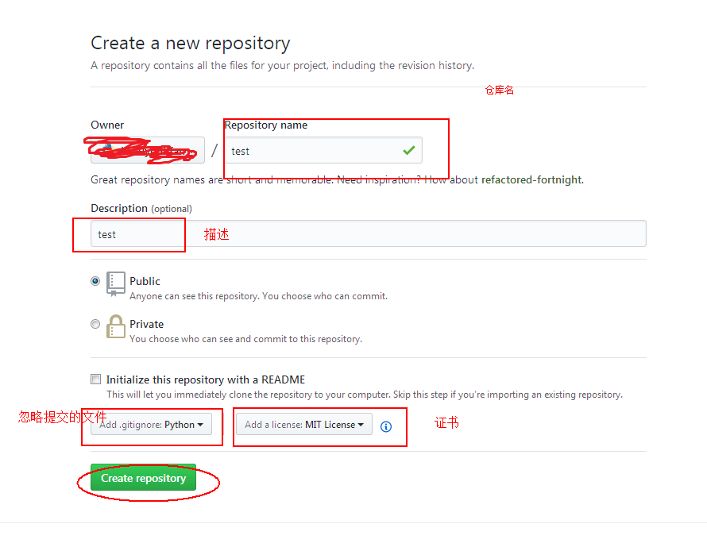
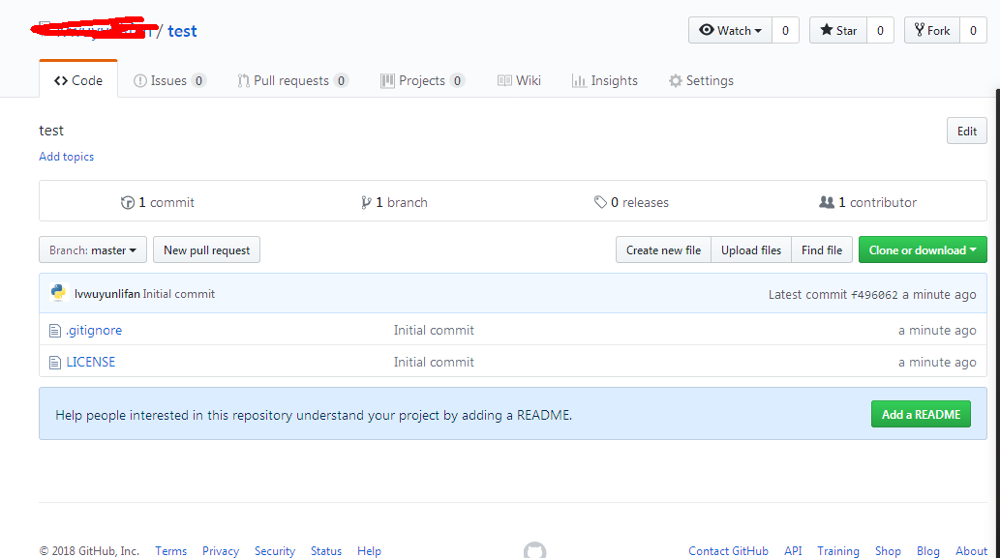

# Git使用

Git工具的使用文档

[TOC]

### 一、如何在github创建新的仓库项目

#### 步骤：

##### 1.在your profile的Repositories，点击创建，如下图： 


##### 2.填写Repository信息



根据需求填写就好

##### 3.创建成功之后



##### 4.这样你就创建好了一个仓库，接下来的事情是你怎么把本地的git仓库和这个仓库相连接

在本地git仓库下打开git bash，执行如下操作，实现一次本地提交： 

```
Administrator@V1BECM4KRXA7UVW MINGW64 /e/Git
$ git init
Initialized empty Git repository in E:/Git/.git/
$ git remote add origin https://github.com/zhouphenix/Docs.git
fatal: remote origin already exists.
Administrator@V1BECM4KRXA7UVW MINGW64 /e/Git (master)
$ git remote rm origin

Administrator@V1BECM4KRXA7UVW MINGW64 /e/Git (master)
$ git remote add origin https://github.com/zhouphenix/Docs.git

Administrator@V1BECM4KRXA7UVW MINGW64 /e/Git (master)
$ git pull https://github.com/zhouphenix/Docs.git

remote: Enumerating objects: 4, done.
remote: Counting objects: 100% (4/4), done.
remote: Compressing objects: 100% (3/3), done.
remote: Total 4 (delta 0), reused 0 (delta 0), pack-reused 0
Unpacking objects: 100% (4/4), done.
From https://github.com/zhouphenix/Docs
 * branch            HEAD       -> FETCH_HEAD

Administrator@V1BECM4KRXA7UVW MINGW64 /e/Git (master)
$ git add RES

Administrator@V1BECM4KRXA7UVW MINGW64 /e/Git (master)
$ git status
On branch master
Your branch is up to date with 'origin/master'.

Changes to be committed:
  (use "git reset HEAD <file>..." to unstage)

        new file:   RES/20180307161211461.png
        new file:   RES/20180307161342565.png
        new file:   RES/20180307161544685.png

Changes not staged for commit:
  (use "git add <file>..." to update what will be committed)
  (use "git checkout -- <file>..." to discard changes in working directory)

        modified:   README.md

Untracked files:
  (use "git add <file>..." to include in what will be committed)

        git.md
Administrator@V1BECM4KRXA7UVW MINGW64 /e/Git (master)
$ git commit -m "commit git.md"
[master cb41a92] commit git.md
 5 files changed, 79 insertions(+)
 create mode 100644 RES/20180307161211461.png
 create mode 100644 RES/20180307161342565.png
 create mode 100644 RES/20180307161544685.png
 create mode 100644 git.md

Administrator@V1BECM4KRXA7UVW MINGW64 /e/Git (master)
$ git push -u origin master
Username for 'https://github.com': 461862064@qq.com
Enumerating objects: 10, done.
Counting objects: 100% (10/10), done.
Delta compression using up to 4 threads
Compressing objects: 100% (8/8), done.
Writing objects: 100% (8/8), 88.92 KiB | 14.82 MiB/s, done.
Total 8 (delta 0), reused 0 (delta 0)
To https://github.com/zhouphenix/Docs.git
   3110eb6..cb41a92  master -> master
Branch 'master' set up to track remote branch 'master' from 'origin'.

```

git 相关操作解释：

初始化本地git仓库: ` git init`

绑定本地和github上的远程仓库:  ` git remote add origin https://github.com/zhouphenix/Docs.git` 

如果出现错误提醒：fatal: remote origin already exists.  则先执行：`git remote rm origin`，再执行绑定

刚开始仓库什么都没有，执行：

`git push -u origin master`

如果出现错误提示：hint: See the 'Note about fast-forwards' in 'git push --help' for details.说明本地仓库和远程仓库版本不一致，则先：

`git pull https://github.com/zhouphenix/Docs.git`

如果报错：fatal: refusing to merge unrelated histories


那说明有冲突，则执行：

`git pull origin master --allow-unrelated-histories`

`git status`  # 找出红色标注的进行解决冲突，解决完了之后：

`git add .`

`git commit -m 'some thing'`

`git push origin master`

进行远程推送。至此已完成。


