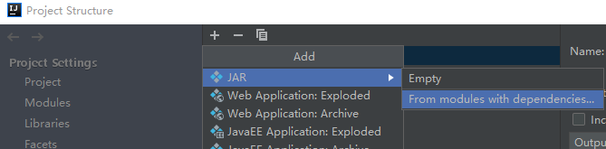
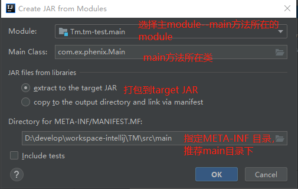
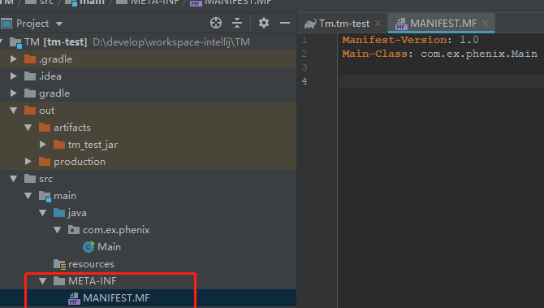

# idea_java_gradle配置打包可执行jar

[TOC]

#### 目录

##### 1.新建java-gradle工程

略...

##### 2.配置入口main类， 以及main方法

略...

##### 3.配置build.gradle 

```
plugins {
    id 'java'
    id 'application' // 可执行
}
//...
mainClassName = 'com.xx.Main' //配置主类
```

##### 4.配置Artifacts 打包jar

###### 4.1 Project Structure > add jar




###### 4.2 create jar



之后会生成META-INF文件



确保Alt+左键 能够正常索引到main方法才能保证执行jar包时找到入口

###### 4.3 build jar

Build菜单 > Build Artifacts... >Action 

之后就会在


###### 4.4 测试jar

dos命令 ` java -jar jar绝对路径`


