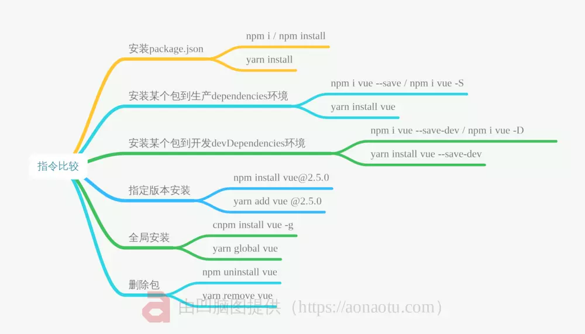

# phenix

> A Vue.js project

[TOC]

```
██╗    ██╗ █████╗ ███╗   ██╗
██║    ██║██╔══██╗████╗  ██║
██║ █╗ ██║███████║██╔██╗ ██║
██║███╗██║██╔══██║██║╚██╗██║
╚███╔███╔╝██║  ██║██║ ╚████║
 ╚══╝╚══╝ ╚═╝  ╚═╝╚═╝  ╚═══╝
                            
```

## 一、Build Setup
预先安装Node.js(附带npm)

``` bash
# install yarn
npm install -g yarn

# 查看版本
node -v

# serve with hot reload at localhost:8080
npm run dev

# 全局安装vue脚手架 npm install -g vue-cli 需要翻墙
npm install -g vue-cli 

# 如果之前已经安装过旧版本（非3.x）脚手架，需要卸载旧版本：
npm uninstall vue-cli -g
# 安装脚手架，用于生成项目
npm install -g @vue/cli
#yarn 安装
yarn global add @vue/cli
yarn global add @vue/cli-init
#快速原型开发，编译.vue文件
npm install -g @vue/cli-service-global


#  创建一个基于 webpack 模板的新项目
 vue init webpack phenix
 ...
 cd phenix
 yarn
 yarn start
 
#vue-cli3
vue create my-project
 
 
 
```

### 1.1[使用 vue-cli 3 快速创建 Vue 项目](使用 vue-cli 3 快速创建 Vue 项目.md)

For a detailed explanation on how things work, check out the [guide](http://vuejs-templates.github.io/webpack/) and [docs for vue-loader](http://vuejs.github.io/vue-loader).

## 二、引入Element UI

```$xslt
npm i element-ui -S
H:\Yarn-Manage\phenix>npm i element-ui -S
npm WARN deprecated mixin-deep@1.3.1: Critical bug fixed in v2.0.1, please upgrade to the latest version.
npm WARN deprecated set-value@2.0.0: Critical bug fixed in v3.0.1, please upgrade to the latest version.
npm WARN deprecated set-value@0.4.3: Critical bug fixed in v3.0.1, please upgrade to the latest version.
npm WARN deprecated browserslist@2.11.3: Browserslist 2 could fail on reading Browserslist >3.0 config used in other tools.
npm WARN deprecated browserslist@1.7.7: Browserslist 2 could fail on reading Browserslist >3.0 config used in other tools.
npm WARN deprecated flatten@1.0.2: I wrote this module a very long time ago; you should use something else.
npm WARN deprecated bfj-node4@5.3.1: Switch to the `bfj` package for fixes and new features!
npm WARN rm not removing H:\Yarn-Manage\phenix\node_modules\.bin\browserslist.cmd as it wasn't installed by H:\Yarn-Manage\phenix\node_modules\browserslist
npm WARN rm not removing H:\Yarn-Manage\phenix\node_modules\.bin\browserslist as it wasn't installed by H:\Yarn-Manage\phenix\node_modules\browserslist

> core-js@2.6.9 postinstall H:\Yarn-Manage\phenix\node_modules\core-js
> node scripts/postinstall || echo "ignore"

Thank you for using core-js ( https://github.com/zloirock/core-js ) for polyfilling JavaScript standard library!

The project needs your help! Please consider supporting of core-js on Open Collective or Patreon: 
> https://opencollective.com/core-js 
> https://www.patreon.com/zloirock 

Also, the author of core-js ( https://github.com/zloirock ) is looking for a good job -)


> uglifyjs-webpack-plugin@0.4.6 postinstall H:\Yarn-Manage\phenix\node_modules\webpack\node_modules\uglifyjs-webpack-plugin
> node lib/post_install.js

npm notice created a lockfile as package-lock.json. You should commit this file.
npm WARN optional SKIPPING OPTIONAL DEPENDENCY: fsevents@1.2.9 (node_modules\fsevents):
npm WARN notsup SKIPPING OPTIONAL DEPENDENCY: Unsupported platform for fsevents@1.2.9: wanted {"os":"darwin","arch":"any"} (current: {"os":"win32","arch":"
x64"})

+ element-ui@2.9.2
added 81 packages from 65 contributors, removed 45 packages, updated 823 packages and audited 11562 packages in 478.78s
found 6 vulnerabilities (4 moderate, 2 high)
  run `npm audit fix` to fix them, or `npm audit` for details

```

## 三、[引入IView](https://www.iviewui.com)

```
yarn add iview
```
## 四、Vue.js Ajax(axios)

 Vue.js 2.0 版本推荐使用 axios 来完成 ajax 请求。

 Axios 是一个基于 Promise 的 HTTP 库，可以用在浏览器和 node.js 中。

 Github开源地址： https://github.com/axios/axios

```
yarn add axios
yarn add vue-axios
```
进行安装。
安装完成后在main.js中使用axios，在main.js中加入以下代码
```
import axios from 'axios'
import VueAxios from 'vue-axios'
Vue.use(VueAxios, axios)
```

这样就可以在全局中使用axios做请求了。
我们在表单校验通过的时候使用axios来请求后台。代码如下

```vue
handleSubmit(name) {
                this.$refs[name].validate((valid) => {
                    if (valid) {
                        this.axios({
                            url: '',//请求的地址
                            method: 'post',//请求的方式
                            data: this.formInline//请求的表单数据
                        }).then(res => {
                            console.info('后台返回的数据', res.data);
                        }).catch(err => {
                            console.info('报错的信息', err.response.message);
                        });
                    } else {
                        this.$Message.error('表单校验失败!');
                    }
                })
            }
```


## 附件：

### 1.npm 和yarn比较

|                 npm                  |             yarn              |             用法             |
| :----------------------------------: | :---------------------------: | :--------------------------: |
|             npm install              |         yarn install          | 一键安装package.json的所有包 |
|  npm install [package] --save / -S   |      yarn add [package]       |      安装到dependencies      |
| npm install [package] --save-dev/ -D | yarn add [package] --save-dev |    安装到devDependencies     |
|       npm i [package]@[版本号]       |  yarn add [package]@[版本号]  |      指定版本号下载更新      |
|    npm install [package] --global    |   yarn global add [package]   |        全局安装某个包        |
|         npm update --global          |      yarn updade upgrade      |          更新所有包          |
|       npm uninstall [package]        |     yarn remove [package]     |          删除某个包          |




### 2.Vue 调用子组件方法
```vue
this.$refs.fb.setText(txt)
this.$refs[name].setText(txt)

```


### 3.缺少windows构建插件**


**解决方法：在命令行工具中运行：npm install –global –production windows-build-tools （全局安装windows构建工具）**